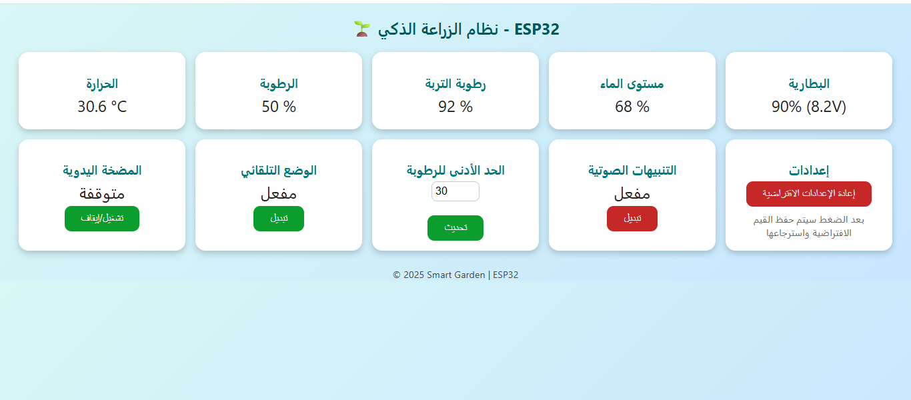

# 🌱 Smart Garden ESP32

A smart irrigation and monitoring system built on the ESP32. It tracks soil moisture, temperature, water tank level, and battery charge, automatically runs the water pump when needed, and exposes a live web dashboard accessible from any device on the same network.

> Note: the on-device web dashboard UI is in Arabic, as it's built for Arabic-speaking end users. Code and documentation are in English.

## ✨ Features

- 📊 Real-time temperature and humidity monitoring (DHT11)
- 🌱 Soil moisture sensing with automatic irrigation below a configurable threshold
- 💧 Water tank level measurement via ultrasonic sensor
- 🔋 Battery voltage and charge percentage monitoring
- 🔔 Audio/visual alerts on low battery or low water level
- 🖥️ Local LCD display showing live readings
- 🌐 Web dashboard for remote control:
  - Manual pump on/off
  - Toggle automatic mode
  - Adjust soil moisture threshold
  - Toggle audio alerts
  - Reset settings to defaults
- 💾 Persistent settings storage via `Preferences` (survives reboots)

## 🛠️ Hardware

| Component | Purpose |
|---|---|
| ESP32 | Main controller (WiFi + processing) |
| DHT11 | Air temperature & humidity |
| Soil Moisture Sensor | Soil moisture level |
| HC-SR04 | Water tank level (ultrasonic) |
| Water pump (relay-driven) | Irrigation |
| I2C LCD (20x4) | Local readout |
| LED + Buzzer | Alerts |
| Voltage divider circuit | Battery voltage sensing |

## 💻 Software / Libraries

Install the following via the Arduino IDE Library Manager:

- `WiFi.h` (bundled with ESP32 board package)
- `WebServer.h` (bundled with ESP32 board package)
- `Wire.h` (bundled)
- `LiquidCrystal_I2C`
- `DHT sensor library` (by Adafruit)
- `Preferences.h` (bundled with ESP32 board package)

## ⚙️ Setup

1. **Clone the repository:**
   ```bash
   git clone https://github.com/Husamiah/smart-garden-esp32.git
   cd smart-garden-esp32
   ```

2. **Set up your WiFi credentials:**
   ```bash
   cp secrets.h.example secrets.h
   ```
   Then edit `secrets.h` with your own values:
   ```cpp
   const char* ssid = "YOUR_WIFI_NAME";
   const char* password = "YOUR_WIFI_PASSWORD";
   ```

3. **Open the project in Arduino IDE:**
   - Open `un_project.ino`
   - Make sure `secrets.h` is in the same folder

4. **Select the correct board:**
   - Tools → Board → ESP32 Arduino → (select your specific board, e.g. ESP32 Dev Module)

5. **Wire up the components (pin configuration):**

   | Component | Pin |
   |---|---|
   | DHT11 | GPIO 4 |
   | Soil Moisture | GPIO 36 |
   | Ultrasonic TRIG | GPIO 17 |
   | Ultrasonic ECHO | GPIO 16 |
   | Pump | GPIO 25 |
   | LED | GPIO 13 |
   | Buzzer | GPIO 26 |
   | Battery Sense | GPIO 34 |

6. **Upload the sketch** to the ESP32.

7. Once connected to WiFi, the device's IP address is shown on the LCD screen — open it in a browser on the same network to access the dashboard.

## 🖥️ Web Dashboard

A lightweight dashboard (in Arabic) that auto-refreshes every second and displays:
- Temperature, humidity, soil moisture, water level, and battery status
- Manual pump control
- Automatic mode toggle and moisture threshold adjustment
- Audio alert toggle



## 🚧 Future Work

- Historical data logging
- Mobile app or Telegram bot integration for alerts
- Multi-zone irrigation support
- Authentication for the web dashboard

## 📄 License

This project is licensed under the [MIT License](LICENSE).
